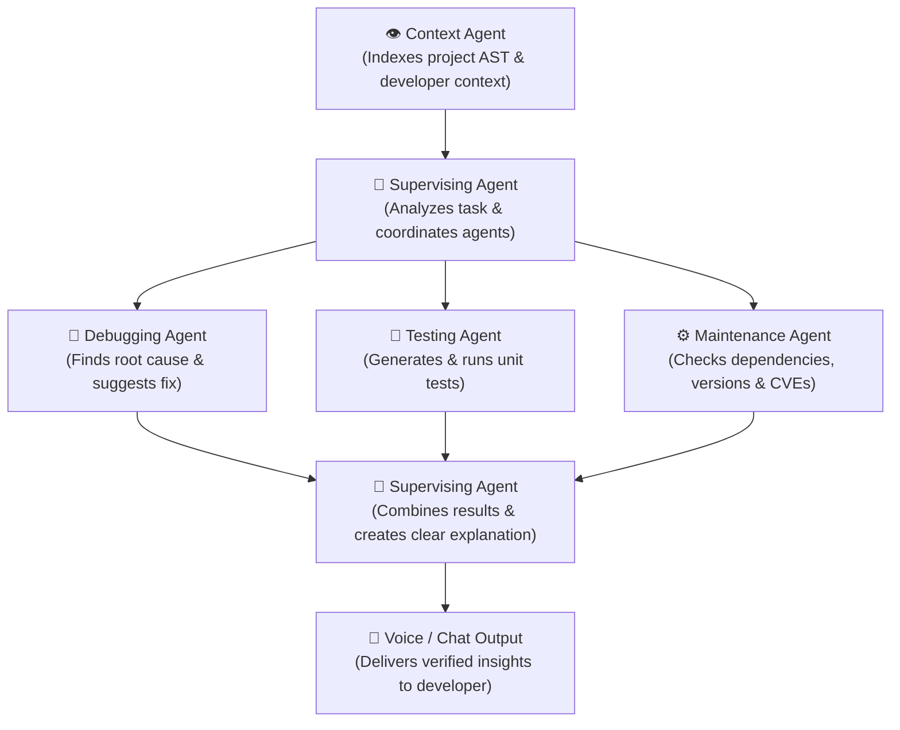

# 🤖 DevAssist AI — AI Multi-Agent Developer Assistant

> **Smarter Development. Faster Results.**  
> An intelligent multi-agent system that helps developers across the complete software development lifecycle — from code understanding to debugging, testing, maintenance, and beyond.

---

## 🌟 Overview & Architecture

DevAssist AI demonstrates a state-of-the-art **Multi-Agent Swarm** designed to pair with developers in real time. It coordinates 5 specialized agents operating in parallel:



---

## 🚀 Key Features

1. **5-Step SDLC Onboarding Workflow**:
   - `1. Login & Consent` — Sandboxed local workspace permissions & safety guardrails.
   - `2. Select Project` — Workspace directory loader (`C:\Projects\MyWebApp`).
   - `3. Start Session` — Real-time AST indexing & AST listener initialization.
   - `4. Work Normally` — Seamless IDE integration (VS Code & JetBrains companion).
   - `5. Get Help & Insights` — Instant multi-agent resolution via interactive chat & voice.

2. **Parallel Agent Execution & Swarm Synthesis**:
   - **Context Agent**: Gathers AST structure, git diffs, buffer exceptions.
   - **Supervising Agent**: Breaks complex requests into sub-tasks and synthesizes final resolution.
   - **Debugging Agent**: Detects unhandled exceptions (e.g. `TokenExpiredError` at line 42), produces patch.
   - **Testing Agent**: Creates unit test suites and validates regressions (5/5 suites passing).
   - **Maintenance Agent**: Identifies outdated packages and CVE security advisories (`jsonwebtoken` upgrade alert).

3. **Interactive Multi-Modal UI**:
   - 🎙️ **Voice Companion Studio** with animated audio waveform, speech transcript, and natural neural voice controls.
   - 💻 **Real IDE View** featuring dark code editor, inline error diagnostics, diff comparisons, and instant patch application.
   - 📊 **Agent Workflow Diagram** with live animated state transitions during analysis.
   - 🪵 **Live Multi-Agent Terminal Logs** with agent filtering and timestamped IPC events.

---

## 🛠️ Tech Stack

- **Framework**: React 18
- **Bundler & Dev Server**: Vite 6
- **Styling**: Tailwind CSS 3 (Dark glassmorphic slate theme)
- **Icons**: Lucide React
- **State Management**: React Context (`AppContext`)

---

## 💻 Getting Started

### 1. Installation

```bash
cd C:\Users\sanma\.gemini\antigravity\scratch\ai-developer-assistant
npm install
```

### 2. Run the Development Server

```bash
npm run dev
```

Visit the local server in your browser: `http://localhost:3000`

### 3. Build for Production

```bash
npm run build
```

---

## 📂 Project Structure

```
ai-developer-assistant/
├── index.html
├── package.json
├── vite.config.js
├── tailwind.config.js
├── postcss.config.js
├── src/
│   ├── main.jsx
│   ├── App.jsx
│   ├── index.css
│   ├── context/
│   │   └── AppContext.jsx          # Central multi-agent state & scenario simulator
│   ├── data/
│   │   └── mockData.js            # Pre-configured scenarios, agents, AST code & logs
│   ├── components/
│   │   ├── layout/
│   │   │   ├── Header.jsx         # App title, system health badge, simulation button
│   │   │   └── Sidebar.jsx        # Navigation, DevAssist brand, user profile
│   │   ├── onboarding/
│   │   │   └── WorkflowStepsBar.jsx # 5-step horizontal onboarding pipeline
│   │   ├── dashboard/
│   │   │   ├── ProjectOverviewCard.jsx
│   │   │   ├── AgentStatusCard.jsx
│   │   │   ├── QuickActionsCard.jsx
│   │   │   ├── AgentWorkflowDiagram.jsx
│   │   │   ├── EndToEndWorkflowPipeline.jsx
│   │   │   ├── RealIDEViewCard.jsx
│   │   │   └── KeyFeaturesCard.jsx
│   │   ├── chat/
│   │   │   ├── AIAssistantChat.jsx
│   │   │   ├── MultiAgentResponseCard.jsx
│   │   │   ├── AudioWaveformPlayer.jsx
│   │   │   └── ChatInput.jsx
│   │   ├── modals/
│   │   │   ├── ProjectStructureModal.jsx
│   │   │   ├── AgentLogsModal.jsx
│   │   │   ├── InspectCodeModal.jsx
│   │   │   ├── ProjectSelectorModal.jsx
│   │   │   └── ConsentModal.jsx
│   │   └── views/
│   │       ├── DashboardView.jsx
│   │       ├── AgentsView.jsx
│   │       ├── IDECompanionView.jsx
│   │       ├── VoiceStudioView.jsx
│   │       └── SettingsView.jsx
```
